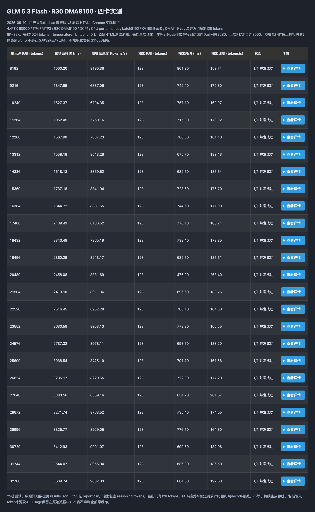

# GLM-5.3-Flash on 4 × RTX 6000D — R30 DMA9100 lab

四卡 84 GB RTX 6000D 的 GLM-5.3-Flash-NVFP4 部署、源码适配及实测记录。2026-09-10 导出，当前日常服务固定在 **R30 / TP4 / DCP1 / MTP3 / 350 W 每卡 / DMA 四分片**。

**English:** Reproducible R30 serving profile and bounded BF16 projection / graph-lifetime adaptations for four RTX 6000D GPUs. This repository separates measured configurations, speculative output throughput, verifier speed, cold prefill and finite-burst throughput. It does not claim a new CUDA math kernel or parity with the full RTX PRO 6000.

## 实际达到什么程度

| 测量 | 本机结果 | 说明 |
|---|---:|---|
| DMA9100 冷 nominal 32K prefill | **9,134 tok/s** | 12 冷样本 × 3 轮的轮中位数；另一个 DMA→NCCL→DMA 实验为 9,130→8,168→9,120 |
| DMA9100 相关控制组 C1 decode | **187.69 tok/s / 76.33 verifier steps/s** | batch8192/KV16，单组；不是旧 decode 最优配置的重测 |
| 早期 decode 优化后的 C1 | **194.64–204.59 tok/s** | 三轮，verifier 中位数 78.74 steps/s，batch4096；输出受 MTP 接受率影响 |
| 早期容量配置 C8 / C32 / C64 | **648.45 / 1,350.57 / 1,934.76 tok/s** | 持续生成总吞吐，batch4096/KV20；实际活跃路数达标 |
| 最新原 HTML 跑分 | **25/25 完成** | C1，8K–32K 输入，128 输出；完整表与截图附后 |

**Prefill ≥11,000 和 CC32 持续总 decode >2,000 的目标尚未达到。当前 DMA9100 没有重跑完整 CC1–64 矩阵，不能把历史并发结果标成当前配置成绩。**

## 平台

| 项目 | 实测/配置 |
|---|---|
| 整机 / 主板 | Supermicro SYS-551A-T / X13SWA-TF |
| CPU | Intel Xeon w5-3433，16 核 32 线程，单插槽 / 单 NUMA |
| 内存 / 系统盘 | 标称 64 GB RAM；WD Blue SN5000 2 TB NVMe |
| GPU | 4 × NVIDIA RTX 6000D，84 GB SKU，156 SM，SM120 |
| 互联 | 四卡 PCIe 5.0 ×16，跨 CPU 根端口，P2P；无 NVLink |
| GPU 功耗上限 | 350 W/卡，启动前校验，并由 systemd 开机恢复 |
| OS / 驱动 | Ubuntu 22.04.5 LTS；当前 Linux 6.8.0-138-generic；NVIDIA 580.178.04 OPEN |
| 推理栈 | R30，PyTorch 2.13.0 / CUDA 13.3，vLLM 0.26.1rc0+glm53.r30.vllm60e72555 |
| 权重 / KV / 投机 | NVFP4 权重，MoE BF16 激活 W4A16，FP8 target KV，MTP3 |
| 当前服务容量 | max model len 262144，max seqs 64，batch8192，KV16 GiB/卡 |

详细限制和历史系统差异见 [硬件与运行配置](docs/HARDWARE.md)。镜像、源码和模型元数据 hash 见 [SOURCE_LOCK.json](SOURCE_LOCK.json)。模型权重及镜像不随仓库上传。

## 社区对照

| 指标 | 本机 | 社区 | 对比边界 |
|---|---:|---:|---|
| 冷32K prefill | 9,134 | 14,288 | R30 MTP3/DCP1/GPU-local；本机 batch8192，对方4096 |
| 早期最优 C1 verifier | 78.74 | 102.26 | steps/s；同为 R30 MTP3，本机 MoE 激活精度调整 |
| 历史 C8 总输出 | 648.45 | 872.463 | 对方 **R28.1 / DCP4 / LMCache**，不是 R30 同配置 |
| 历史 C32 总输出 | 1,350.57 | 1,678.246 | 同上，30 秒窗口 |
| 历史 C64 总输出 | 1,934.76 | 2,259.338 | 同上，不能用不同窗口的中位数替换 |

社区为四张 stock RTX PRO 6000 96 GB，本机为四张 6000D 84 GB、350 W。R30 **没有重新报告 C8/C64**，历史数据不能改名为 R30。来源：[R30](https://github.com/local-inference-lab/rtx6kpro/blob/2a763eb0de595cd6a432971781dbaf1634f858bc/models/glm-5.3-flash/validation/shared-serving-r30.md)、[R28.1](https://github.com/local-inference-lab/rtx6kpro/blob/2a763eb0de595cd6a432971781dbaf1634f858bc/models/glm-5.3-flash/validation/scheduler-serving-r28.1.md)。完整逐档表、脚本差异与局限见 [Benchmark 报告](docs/BENCHMARKS.md)。

## 使用与目录

1. [部署和开机自启](docs/DEPLOYMENT.md)：固定镜像、模型路径、四个源码文件、功率校验和 systemd。
2. [测试复现](docs/REPRODUCIBILITY.md)：持续生成、固定12冷样本、冷8K/4K与原HTML四种口径。
3. [优化分析](docs/OPTIMIZATION.md)：通信、MoE、CuTe投影、mHC，以及未采用的试验。
4. [上游贡献建议](docs/UPSTREAM.md)：拆分候选改动和待补验证。
5. [原HTML 25档报告](reports/html-single/report.html) / [CSV](reports/html-single/report.csv) / [机器可读结果](results/html-dma9100-v2.json)。下载 HTML 后本地打开；GitHub 文件预览不会执行它。

`patches/` 保存实际部署的四个原样文件及相对 R30 的 diff；`qualification/` 保存数值/图重放检查；`results/` 保存数字证据。`benchmarks/` 获取固定版本的公共测试工具并提供受控运行入口。

本次公开导出保留数字、方法与来源，移除了实际管理地址、凭据、业务请求正文和私有会话。部分 JSON 中的历史 raw 路径仅表示原始证据来源，未包含全部 trace 大文件；详见 [导出来源](results/export-provenance.json)。[许可证与第三方声明](THIRD_PARTY_NOTICES.md)。
