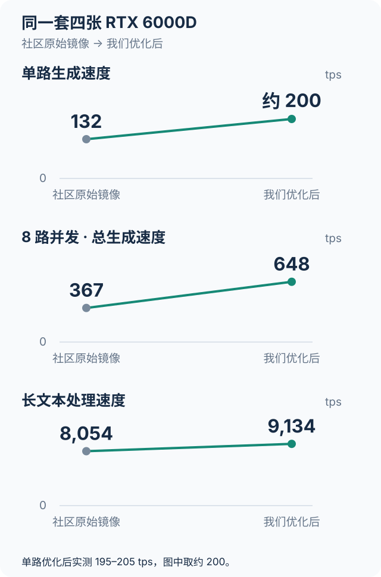

# Benchmark：原始本机、最终已测与社区参考

所有本机速度单位为 tok/s，verifier 为 steps/s。本文只保留原始起点和最终已测记录；中间试验仍保存在机器可读 JSON 中，不作为这份公开对比的叙事主线。

## 三列对比

| 指标 | 原始本机 | 最终已测 | 社区参考 |
|---|---:|---:|---:|
| 冷 nominal 32K prefill | 8,054 | 9,134 | 14,288（R30） |
| C1 持续输出 | 132.09 | 194.64–204.59 | 249.06（R30） |
| C1 verifier | 55.28 | 78.74 | 102.26（R30） |
| C8 持续总输出 | 366.66 | 648.45 | 872.463（R28.1） |
| C32 持续总输出 | —（原始起点未测） | 1,350.57 | 1,678.246（R28.1） |
| C64 持续总输出 | —（原始起点未测） | 1,934.76 | 2,259.338（R28.1） |

社区参考为四张 stock RTX PRO 6000 96 GB；本机为四张 RTX 6000D 84 GB、350 W/卡。社区 R30 的 C8/C32/C64 未重测，因此这些行只引用 R28.1；它们不能被解读成 R30 同 profile 的横向测试。

## 每行的 profile

| 行 | 原始与最终本机 profile | 社区 profile | 不能据此声称什么 |
|---|---|---|---|
| 冷 nominal 32K prefill | 原始为最初 R30 8 冷请求；最终为 DMA9100、TP4/DCP1/MTP3、350W、batch8192、KV16，12 冷样本 × 3 轮的轮中位数 | R30 / MTP3 / DCP1 / GPU-local、batch4096 | 最终 9,134 不是与 C8/C32/C64 同次的矩阵复测。 |
| C1 持续输出与 verifier | 原始与最终优化记录均为R30、TP4/DCP1/MTP3、350W、batch4096；最终C1三轮，verifier取中位数。原始KV分配和采样次数不按后来的KV20容量配置回填 | R30 / MTP3 / DCP1 / GPU-local | 原始输出和最终输出受 MTP 接受率影响；verifier 是更接近 target forward rate 的辅助口径。 |
| C8/C32/C64 持续总输出 | 最终旧容量 profile：R30、TP4/DCP1/MTP3、350W、batch4096/KV20、context0、预热15秒/测量30秒 | R28.1 / TP4 / DCP4 / LMCache / benchmark0.4.29、stock96GB、30秒窗口 | 648.45 / 1,350.57 / 1,934.76 不是 DMA9100、batch8192/KV16 的重测结果。 |

DMA9100 的相关 C1 控制组是 **187.69 tok/s / 76.33 verifier steps/s**（batch8192/KV16，单组）。它作为当前 prefill profile 的相关控制保留，但不替代旧 batch4096 的 C1 最优三轮记录（KV20另指后来的并发容量配置）。DMA9100 没有完整 CC1–64 矩阵，因此本报告不把两套 profile 合并为“最终同次成绩”。

## 数值来源

- 原始起点、优化后 C1 与 C8：[`results/optimization-results.json`](../results/optimization-results.json)。`glm53-force3` 是另一场基线复测（55.39 steps/s、C8 363.40），未与 132.09/55.28/366.66 混合。
- 最终 prefill 和 DMA9100 控制：[`results/prefill-first-controls.json`](../results/prefill-first-controls.json)、[`results/dma-pieces.json`](../results/dma-pieces.json)、[`results/mhc-graph-v3.json`](../results/mhc-graph-v3.json)、[`results/dma-routing-summary.json`](../results/dma-routing-summary.json)。9,134 来自 DMA4 / capture256 控制的 9,143、9,134、9,131 三轮中位数。
- 最终旧容量 profile：[`results/capacity/c8.json`](../results/capacity/c8.json)、[`c32.json`](../results/capacity/c32.json)、[`c64.json`](../results/capacity/c64.json)。C64 的实际运行数为64、最大排队为0；自动 KV 仅9.65GiB时的容量受限 1,138.16 已排除。
- 社区：固定提交的 [R30 共享服务报告](https://github.com/local-inference-lab/rtx6kpro/blob/2a763eb0de595cd6a432971781dbaf1634f858bc/models/glm-5.3-flash/validation/shared-serving-r30.md) 与 [R28.1 scheduler 报告](https://github.com/local-inference-lab/rtx6kpro/blob/2a763eb0de595cd6a432971781dbaf1634f858bc/models/glm-5.3-flash/validation/scheduler-serving-r28.1.md)。本机 `benchmark0.6.2` 与恢复出的公开 `0.6.1` 除版本字符串外字节相同，但不证明社区当时的私有文件；见 [`results/benchmark-source-equivalence.json`](../results/benchmark-source-equivalence.json)。

## 其它已测口径

最新 DMA9100 的原 HTML 工具在 C1、8K–32K、128 输出的 25 档均完成。8K/16K/24K/32K prefill 分别为 8,190.36 / 8,881.55 / 8,978.11 / 9,002.83，decode 分别为 159.74 / 171.90 / 183.20 / 192.60。该工具通过 Node 流式桥接到认证 LAN 网关，并按客户端估计网络延迟修正；其单样本、短输出口径不用于替代冷32K三轮或持续 decode。完整记录见 [HTML](../reports/html-single/report.html)、[CSV](../reports/html-single/report.csv) 和 [`results/html-dma9100-v2.json`](../results/html-dma9100-v2.json)。

公开导出没有重跑 GPU 基准；它保留数值、方法和来源，并移除了管理地址、凭据、业务请求正文和私有会话。详情见 [`results/export-provenance.json`](../results/export-provenance.json)。
