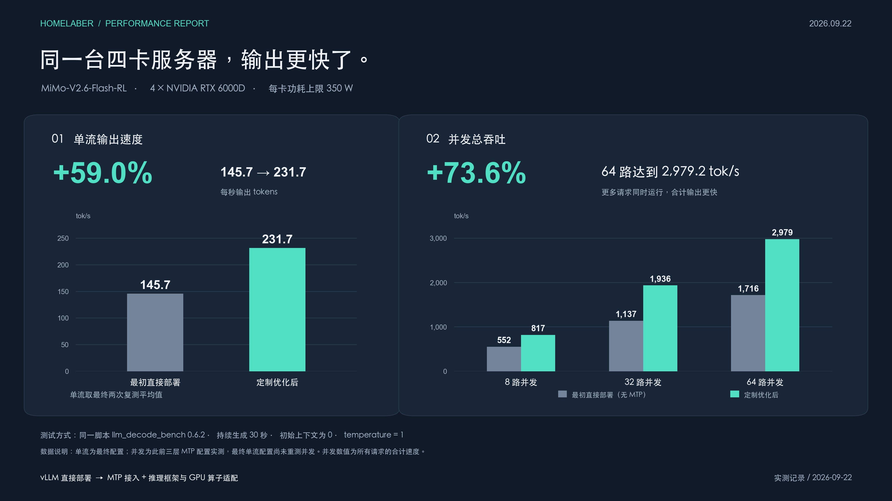

# MiMo V2.6 Flash · 四卡 RTX 6000D

同一台 **4 × RTX 6000D（84GB/卡，350W/卡）**，从 vLLM 直接部署到三层 MTP 与 GPU 算子适配：

| 测试 | 最初直接部署 | 优化后 | 提升 |
|---|---:|---:|---:|
| 单流 Decode | 145.7 | **231.7** | **+59.0%** |
| 8 路总吞吐 | 552.0 | **817.5** | **+48.1%** |
| 32 路总吞吐 | 1,137.1 | **1,936.3** | **+70.3%** |
| 64 路总吞吐 | 1,716.5 | **2,979.2** | **+73.6%** |

单位均为 tok/s。同脚本 0.6.2、零初始上下文、持续生成 30 秒；单流为最终配置两轮平均，并发为此前三层 MTP 配置实测，最终配置未重测并发。



另外，最终配置 **8K 输入 / 4K 输出**独占三轮平均：**Prefill 8,731 tok/s、Decode 191.9 tok/s、首字等待 0.938 秒**。Prefill 按输入量除以首字等待计算。全部数值见 [results.json](results.json)。

## 使用

基础为 vLLM 0.29.0 + B12X，包含 QKV 加载修复、三层 MTP、6000D 小批次计算适配与草稿分布调整。原始权重不改动。

```bash
docker build --platform linux/amd64 -t mimo-v26-flash-6000d:local .
MODEL_PATH=/absolute/path/to/MiMo-V2.6-Flash-RL ./run.sh
curl http://127.0.0.1:8000/health
```

需要四卡 NVIDIA GPU、Docker GPU 支持与本地权重；API 默认仅监听本机。首次加载需要编译。这里公开的是已部署源码和便携构建入口；该构建入口未另行完成干净环境重建验收。固定版本及源码校验值见 [SOURCE_LOCK.json](SOURCE_LOCK.json)。

代码沿用仓库 Apache-2.0 许可；vLLM 派生文件保留原有声明，QKV 修复来自 vLLM #57508，B12X 来自 voipmonitor/b12x。模型权重与依赖遵循各自许可。
